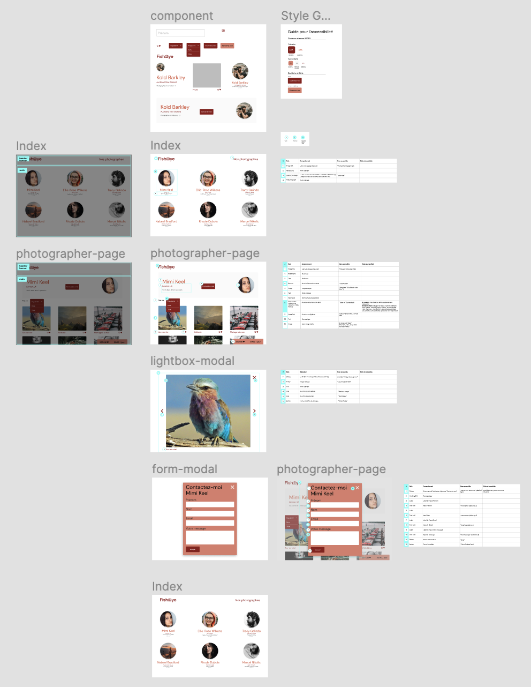

# Projet FishEye

Projet n°5 du parcours javascript-React chez OpenClassrooms. L'objectif est de poursuivre un projet de création d'un site accessible pour une plateforme de photographes (voir les [maquettes Figma](https://www.figma.com/file/Q3yNeD7WTK9QHDldg9vaRl/UI-Design-FishEye-FR?node-id=0%3A1) ).

### Spécifications techniques du projet

- Langages utilisés : HTML, CSS et Javascript

- Validation au W3C

- Compatible avec Chrome et Firefox

- Desktop first puis s’adapte au format responsive